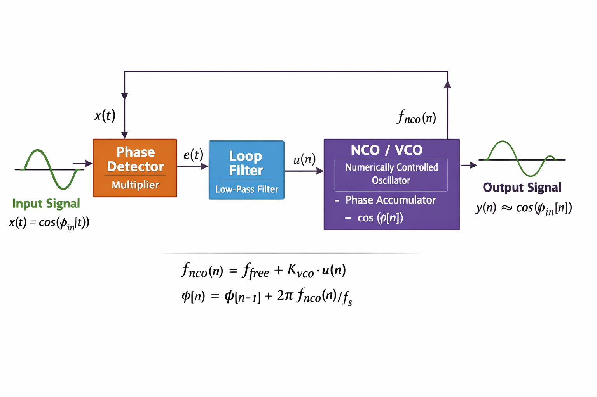
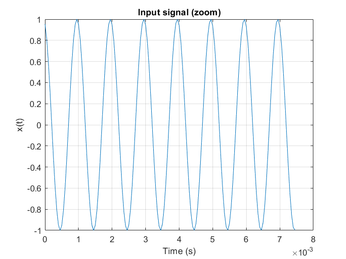
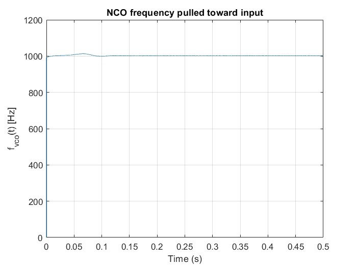
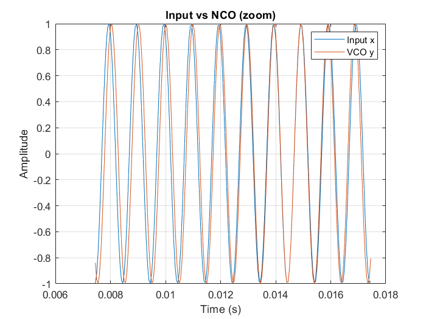

# Phase-Locked Loop (PLL) Demonstration

## What is a PLL?

A Phase-Locked Loop (PLL) is a feedback control system that forces a generated signal to synchronize with a reference signal.

  

Its goal is not just matching frequency, but matching **phase**.

When the phase is aligned, the signals are aligned in time.

In an analog VCO-based PLL, the system corrects phase error by slightly speeding up or slowing down the oscillator.  
The oscillator rotates faster or slower until the input and output signals line up in time.

So the PLL does not jump the waveform forward.  
It continuously adjusts how fast time flows for the oscillator.

---

## From Analog VCO to Digital NCO

In analog systems:

control voltage → changes oscillator frequency

In digital systems we use an **NCO (Numerically Controlled Oscillator)**.

frequency controlled by number → phase accumulator rotates faster

A cosine does NOT fundamentally depend on frequency.  
It depends on angle (phase):

y(t) = cos(φ(t))

So an oscillator is really an **angle generator**.

Frequency is only the speed of angle rotation:

f(t) = (1 / 2π) dφ(t)/dt

Therefore:

dφ = 2π f(t) dt

The digital oscillator integrates frequency into phase.

---

## The MATLAB Demonstration

This project implements a basic digital PLL step by step:

1. Phase detector (multiplier)
2. First-order loop filter
3. NCO (digital VCO)
4. Feedback loop

The objective is to force

φ_NCO → φ_in

When phase matches, the signals match:

y(t) = cos(φ(t)) ≈ x(t)

---

## 1. Setup

For simplicity the reference signal is chosen as:

x(t) = cos(2π f_in t + φ₀)

This gives a known ground truth phase.

**Input signal**

  

---

## 2. NCO Initialization

The NCO starts near the correct frequency but with an error.

The oscillator initially runs slightly faster or slower than the reference.

This creates a growing phase difference that the PLL must correct.

---

## 3. Phase Detector

The phase detector multiplies the input and the NCO output:

e(t) = x(t) · y_NCO(t)

This produces:

- a high-frequency term
- a low-frequency term proportional to phase error

The low-frequency term contains the information we want.

---

## 4. Loop Filter (First Order Low Pass)

The low-pass filter removes the high-frequency mixing component and keeps the phase error estimate.

The filter output becomes the control signal.

This smooths the correction and stabilizes the loop.

---

## 5. Frequency Correction and Phase Integration

The control signal modifies the NCO frequency:

f_NCO(n) = f_free + K_vco u(n)

Since frequency is the rate of phase change:

f(t) = (1 / 2π) dφ/dt

dφ = 2π f(t) dt

In discrete time:

φ[n] = φ[n-1] + 2π f[n] / f_s

So the PLL works as:

phase error → adjust frequency → phase integrates → phase aligns

---

## What the PLL is really doing

The loop tries to make:

φ_NCO = φ_in

Once phase matches:

- timing matches
- frequency automatically matches
- signals overlap

The PLL locks by controlling speed, not position.

---

## Results

**NCO frequency pulled toward input**

  

**Input vs NCO after lock**

  

---

## Key Insight

A PLL does not measure time error directly.

It measures phase error and corrects frequency.

Because phase is the integral of frequency, eliminating phase error automatically eliminates timing error.

---

## 🧑‍💻 Author

**Arman Rajaei**
